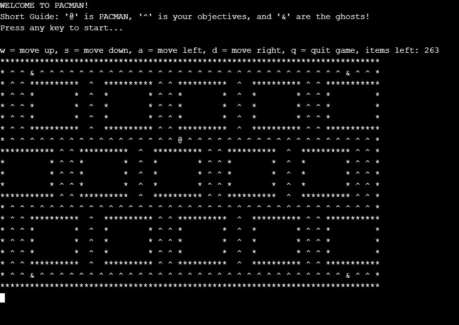

# foge foge em C

Implantação moderna do jogo de arcade Pacman construído com C.
## Produto Final

## Começando

Para começar, basta clonar o repositório e executar o arquivo fogefoge.c em qualquer compilador de sua escolha ou usando um [online compiler](https://www.onlinegdb.com/online_c_compiler).
